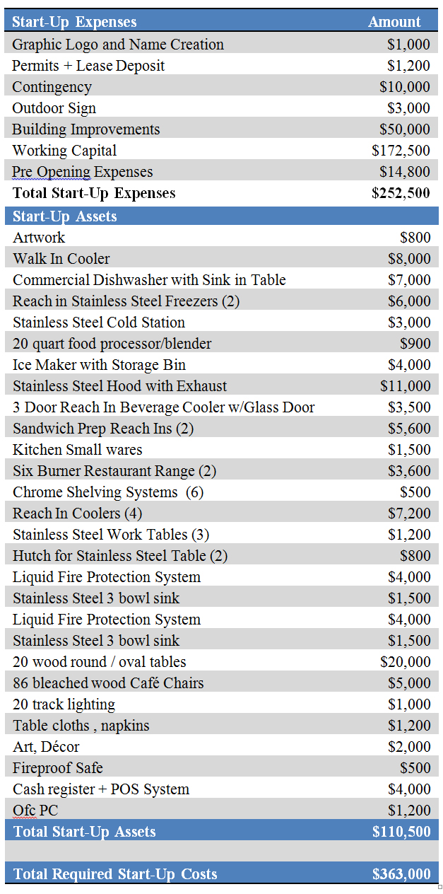
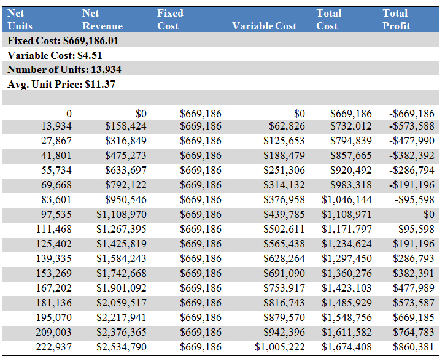
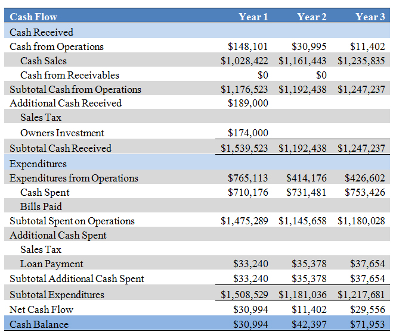
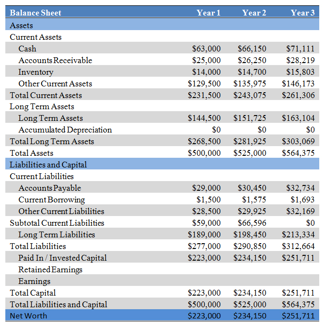
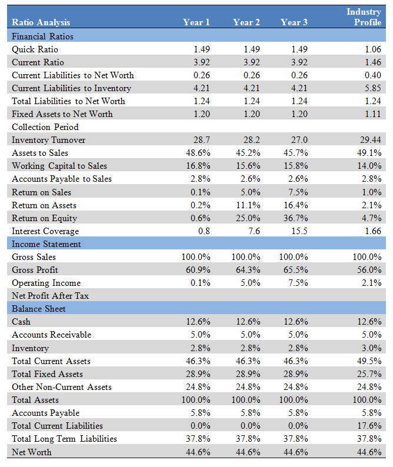
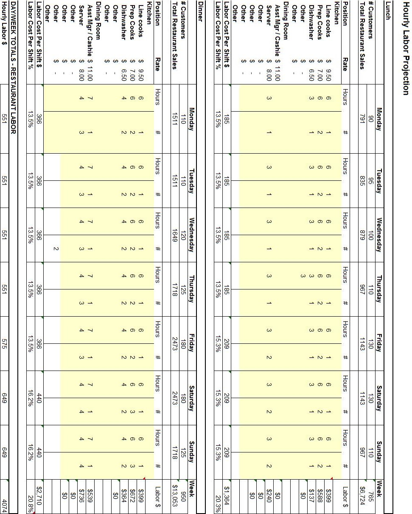
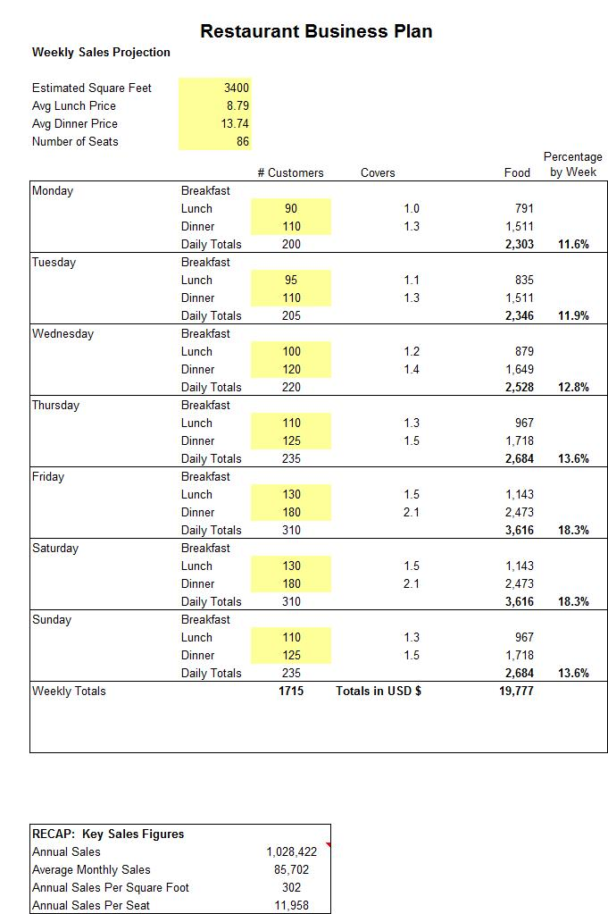

Financial Projections
*********************

Assumptions
===========

About the cost of the foods:

+------------------+-------------------------------------+
| Content          | Estimated Costs                     |
+==================+=====================================+
| Meal             | $8.00 to $15.00                     |
+------------------+-------------------------------------+
| Lunch            | $8.79                               |
+------------------+-------------------------------------+
| Dinner           | $13.74                              |
+------------------+-------------------------------------+

Assumptions about the restaurants:

+------------------+-------------------------------------+
| Restaurants      | Estimation                          |
+==================+=====================================+
| Location         | Downtown Ghetto                     |
+------------------+-------------------------------------+
| Size             | $5000 square feet                   |
+------------------+-------------------------------------+
| Tables           | 20                                  |
+------------------+-------------------------------------+
| Seats            | 86                                  |
+------------------+-------------------------------------+
| Parking space    | 40                                  |
+------------------+-------------------------------------+
| Employee         | 18                                  |
+------------------+-------------------------------------+

   * $860,000 - $1,200,000 revenue target; Industry average for casual restaurant average of $860,000.
   * Annual 3% increase for inflation and 5% annual increase in revenues 
   * Year 2 Assumes Catering Business in Place.  
        - Assumes 4 parties monthly at $15 per plate and $50 persons.  
		- Catering will escalate to 8 parties monthly in month 20 and then 10 parties monthly thereafter.   
		- Assumes additional increase in staffing (4 persons to be hired at 6 hours at $8.00 per hour).

Start-Up Costs
===============

Total start up costs will be $363,000, $174,000 of which will be contributed by the owners and the remainder will be secured through a proposed bank loan.

   Startup costs and expense projection

Source and Use of Funds
=======================

Total start-up costs are estimated to be $363,000.  The majority of the costs are associated with the restaurant equipment, inventory and furniture and furnishings for the dining room.  Total costs for these items are reported to be $110,500.  The costs are associated with build out and renovation of the restaurant to provide updated plumbing and creating additional space in the dining area by removing a non-supporting wall:  $50,000.  Additional start up expenses are in the form of working capital and contingency $182,500.

Jeff and Betty Wright will contribute $174, 000 and are requesting an additional $189,000 in the form of a bank loan. The loan is expected to be a fully amortizing 5 year term note secured by UCC filings on all furniture fixtures and equipment.  

   Estimated source and use of funds

Break-Even Analysis
====================

Total fixed costs associated with the restaurant are $669,186 and represent the annual expenses. The variable cost (overhead) is estimated to be $4.51 per meal.  Based on the assumption of $11.37 as the average meal price, the breakeven revenue then is $1,108,970 or 97,535 meals (units). This is further depicted in the Table Below and the Graph that follow:

   Projected break-even analysis

Financial Projections
=====================

Projected Profit and Loss
-------------------------

The profit and loss demonstrates modest increases in revenues over the three expected years with adjustments for inflation.

   Projected profit and loss

Projected Cash Flow
-------------------

   Projected cash flow

Projected Balance Sheet
-----------------------

   Projected balance sheet

Business Ratios
===============

   Ratio analysis

Hourly Labor Schedule
=====================

   Hourly labout projection

Weekly Sales Projections
========================

   Weekly sales projection
