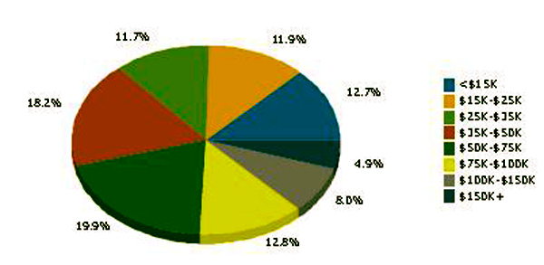

Industry Analysis
*****************

The restaurant industry is a large and diverse business: Restaurant-industry sales are forecast to reach $580.1 billion in 2010 – an increase of 2.5 percent over 2009.  Restaurant-industry sales are projected to total $604 billion in 2011 and equal 4 percent of the U.S. gross domestic product.  The overall economic impact of the restaurant industry is expected to exceed $1.7 trillion in 2011.  On a typical day in America in 2010, more than 130 million people will be foodservice patrons.  Sales at full service restaurants reached $184.2 billion in 2010.  Sales at limited service restaurants increased to $164.8 billion in 2010, while snack and non-alcoholic-beverage bar sales rose to $24.7 billion. (National Restaurant Association).

The US restaurant industry includes about 480,000 restaurants with combined annual revenue of about $400 billion. Major companies include McDonald's; YUM! Brands (KFC, Pizza Hut, Taco Bell); and Darden Restaurants (Olive Garden, Red Lobster). The industry is highly fragmented: the 50 largest companies hold just 20 percent of the market. (First Research).

The industry consists of full-service restaurants (FSR) and limited service eating places, which include quick-service restaurants (QSR); cafeterias; buffets; snack bars; and nonalcoholic beverage bars. (First Research)

Industry Analysis
=================

This analysis is based on the Standard Industry Code (“SIC”) 5812:  Eating and Drinking Places Establishments primarily engaged in the retail sale of prepared food and drinks for on-premise or immediate consumption.  It is also based on the North American Industry Classification System (“NAICS”) 722110 - Full-Service Restaurants. 

This industry comprises establishments primarily engaged in providing food services to patrons who order and are served while seated (i.e., waiter/waitress services) and pay after eating.  These establishments may provide food services to patrons in combination with selling alcoholic beverages, providing carry out services, or presenting live nontheatrical entertainment.

Demographics, consumer tastes, and personal income drive demand.  The profitability of individual companies can vary: while QSRs rely on efficient operations and high volume sales, FSRs rely on high-margin items and effective marketing.  Large companies have advantages in purchasing, finance, and marketing.  Small companies can offer superior food or service.  The industry is labor-intensive. (First Research)

Wages form a significant proportion of operating costs.  The existence of a statutory minimum wage in most states increases the need for players to keep other costs as lean as possible, which in turn increases the importance of suppliers.  A slight complication is that in some states, foodservice employers are able to treat tips received by their staff as contributing to their wages; in such states, this policy reduces the impact of the minimum wage from the employers' perspective. (Data Monitor)  

Annual revenue per worker is less than $50,000. 

Restaurants compete with companies that serve meals or prepared foods, including grocery stores, warehouse clubs, delis, and convenience stores. In addition, restaurants compete with home cooking.

Among FSRs, most establishments focus on Italian cuisine, steak, or seafood.  Hamburger joints make up a majority of QSR locations, along with pizza parlors and sub sandwich shops. Industry revenue is roughly evenly split between FSRs QSRs.

In FSRs, waiters take orders, serve beverages and meals, present the check, and process payment.  FSRs include casual dining (full bar); family dining (limited bar); and fine dining establishments.

Annual sales average $860,000 for FSRs.

An FSR's square footage and the number of seats and tables dictate how many patrons it can serve (also known as table turns or covers) directly affects sales. Because the restaurant industry is highly competitive, site selection is critical: companies may consider population density, household income, competition, visibility, accessibility, and traffic.

Companies carefully manage inventory of perishable food products, such as fresh seafood and dairy goods, to reduce losses due to spoilage.  

Computerized information systems can improve and link food preparation and serving operations.  Touch screen ordering programs ensure accurate communication of customer orders. Timing systems monitor meal progress and can alert staff if an order is running behind schedule.  Reservations programs maximize traffic flow and seating.  Inventory management systems track supply levels and can help reduce waste due to spoilage. Cost accounting programs help companies determine the profitability of individual menu items.  Handheld point-of-sale (POS) devices allow servers to place orders and print checks tableside, improving accuracy and reducing ordering time.  Some handhelds can also print customer checks and process credit card payments. (First Research)

Market Size
-----------

The US restaurant industry includes about 480,000 restaurants with combined annual revenue of about $400 billion.

Industry Participants
---------------------

Major participants include Major companies include McDonald's; YUM! Brands (KFC, Pizza Hut, Taco Bell); and Darden Restaurants (Olive Garden, Red Lobster). 

Main Competitors
----------------

The following restaurants are located within a five mile radius of THR:
 
   * Hedarys Restaurant
             This is a full service family restaurant established in 1977.  The 5,000 SF restaurant run as a sole proprietorship, has 17 employees and generates $1.7 million in revenue annually.  Prices are higher than THR and range from $8.00-$20 per entrée. 
   * Applebee’s
             This is a chain restaurant offering standard fare.  The food quality is average.  Entrées range from $6.99 - $20. 
   * Chili’s
             This is a chain restaurant also offering standard fare.  Food choices are varied and prices range for $8-$21. 
   * Barbeque Ben’s
             This is sole proprietorship offering primarily barbeque item.  Although the food offering does not compete directly with the subject, the restaurant targets the same neighborhood families and has been operating at the single location since 1978.  Entrée range from $8.99-$12.
   * Cracker Barrel
             Located along Interstate 30, the restaurant is not located within the target market area.  However due to its menu offering of home comfort food, the restaurant attracts a similar market, although Cracker Barrel’s attract the tourist business as well.  Entrées range in price from $7.99-$14.
 
    
Market Segments
---------------

THR will appeal to a broad base of consumers in both the residential and business community.  The location selected for THR was chosen primarily to appeal to the growing number of households in the area.

The suburb of Benbrook located in western Forth Worth, TX has a population of over 51,000 according to the 2010 U.S. Census Report. The residential population in the immediate area is comprised of a mixture of single family and multi-family housing. The median household income is $46,532 for 2010 and estimated to be $54,646 for 2015. (US Census).

Major employers include Union Pacific Railroad and Bank of America.  

   Data of market 
 
Market Tests
============

For the past 10 years, Jeff and Betty have been catering part-time.  Their home-style menu is very popular with family reunions.  More often than not, the couple gets asked to open a restaurant full-time so that patrons can return again and again.  

Through Constant Contact (an online marketing program) the couple has stayed in touch with their host and hostesses, and has been asked to return to provide catering services to several repeat events.   Home-Style Catering as also grown by word of mouth.  

The couple also co-authors a  home-style blog - attracting foodies nationwide and globally,  swapping recipes, compiling the most sought after home-style comfort recipes, and identifying current trends, for example, providing expanded menus for children and for those with food allergies.  

The Wrights already have a customer base through their catering business and local blog visitors.  These customers will be the first to be contacted when they announce the grand opening of the brick and mortar restaurant.  

Target Market Segment Strategy
-------------------------------

Jeff and Betty Wright selected the subject area for its restaurant primarily because of its location to the very busy intersection of Cherry Street and Camp Bowie.  The restaurant located in a retail strip center is located on “going home” side of Camp Bowie.  This will encourage families tired from a day of work to stop in for a home cooked meal they can enjoy – without the cleanup!

Cherry Road which runs North and South is connected to the busy Interstate 30 corridor, ½ mile north of the shopping center.  Camp Bowie which runs East and West connects to the newer western suburbs of Fort Worth.

Market Needs
------------

The Benbrook area is in great need of a family style restaurant.  This section of Camp Bowie is commonly referred to as “fast food alley” The selection of fast food is vast however; the area is limited on its family restaurant choices.  THR’s nearest competitor, The Hedary Restaurant is located over 5 miles away from the location.  Further, established in the 1970’s the Hedary Restaurant’s customers are older than the targeted family group THR focuses on.

Market Trends
-------------

According to the National Restaurant Association, the top 10 trends for are: 
   1. locally sourced meats and seafood, 
   2. locally grown produce, 
   3. sustainability as a culinary theme, 
   4. nutritious kids’ dishes, 
   5. hyper-local items, (networked locally grown – like a Craigslist for restaurants)
   6. children’s nutrition as a culinary theme, 
   7. sustainable seafood, 
   8. gluten-free allergy conscious items, 
   9. back to basics cuisine, and 
   10. farm brand ingredients. 

Market Growth
-------------

US consumer spending on services, an indicator of restaurant sales, rose 1.8 percent in November 2011 compared to the same month in 2010.  The average US retail price for diesel and regular gas, which influences discretionary consumer spending on eating out, rose 13.1 percent and 9.3 percent respectively in the week ending January 16, 2012, compared to the same week in 2011.  US tourism spending for food services and drinking places, an indicator for restaurant revenues, increased 6.1 percent in the third quarter of 2011 compared to the same period in 2010. (First Research)

Positioning
===========

Consumers believe that meals at home are healthier and higher quality than eating at restaurants.  At THR, we will position ourselves as the premier home-style restaurant by preparing quality home cooked meals with simple wholesome ingredients.  Jeff and Betty Wright will also provide home cooked fare that appeals to the current trends of healthier food and offer menu selections which will appeal to this group.  THR will be positioned as the premier traditional home-style restaurant.  

