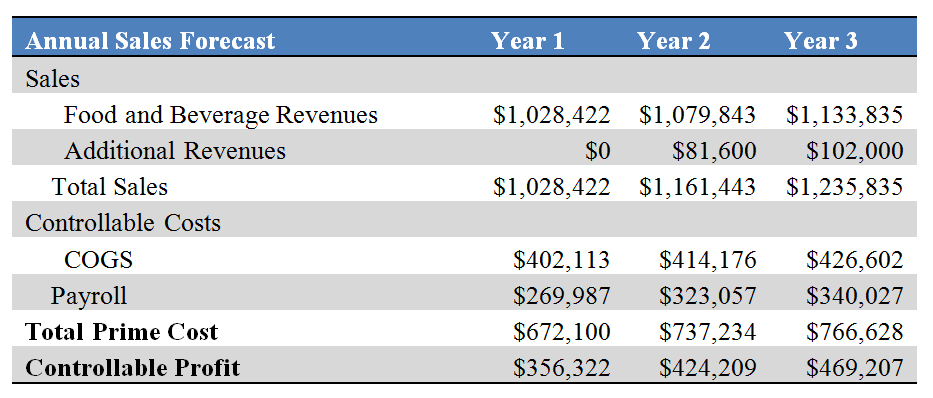
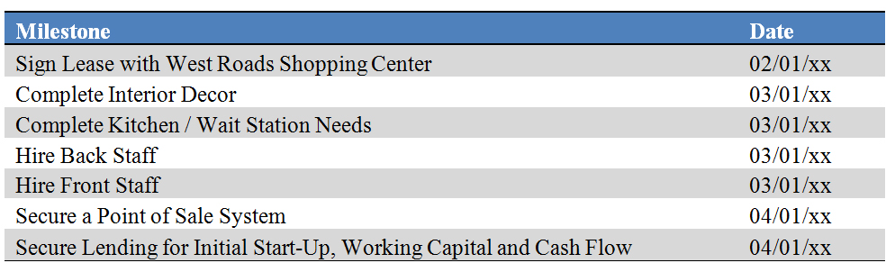

Marketing Strategies
********************

THR will position itself as the premier home-style restaurant in the Benbrook suburb of Fort Worth, Texas.  We will do this by providing quality home style meals, prepared with quality ingredients at a reasonable prices.  Customers will enjoy the quaint surroundings inside with the wood tables and checkered table cloths.  Our restaurant will provide a relaxed atmosphere and when customers walk in they will be greeted by warm smiles and greeted just as they were arriving home.  

The chains have tried to create home-style restaurants but where they have failed is in the personal aspect of the business.  The POS system known as “The Expediter” used to monitor inventories and time meals has replaced one of the most important aspects of a restaurant – the friendliness of the staff!  And in light of this, a handful of chain restaurants are beta testing self-pay tables!

   Marketing Strategies
   
Our customers will enjoy our standard menu fare, along with seasonal menus so that we can better take advantage of cost savings and stay current with some of the food industry trends. 

At THR we plan to be the premier restaurant to work for as well.  We believe that the restaurant industry is a great place to begin one’s career or pursue full-time.  In fact, according to the Restaurant Association, nearly half of all adults have worked in the restaurant industry at some point during their lives, and more than one out of four adults got their first job experience in a restaurant.  At THR we believe that our restaurant will provide job opportunities both for the entry level applicant was well as for the part-time worker searching for flexibly in job hours.  We will pay our employees a competitive salary and believe we can do so by meticulously keeping our records, including daily review of the Prime Cost Report, and utilize Cost Accounting Systems, to prevent inventory shortfalls.  We will be proactive with our employees by scheduling regular performance reviews, and provide bonuses and other incentives to motivate our staff.  We will also provide our employees with the most current training programs regarding safe food handling, and worker protection.  (Additional information regarding our employees is explained in Section 6.1 which follows).

THR will also remain current with current industry marketing tends.  In addition to a website with our menu, map and driving directions, we will also have a Facebook page and utilize other social media such as Twitter.  We will team up with Groupon and Yelp.  We will offer a loyalty club and birthday club which recent reports indicate increases earnings as much as 15%.  

SWOT Analysis
=============

Strengths
---------

   * Prime location with easy access from Interstate 30
   * Exceptional staff with the can do attitude. Combined 25 years in the restaurant industry
   * Because owner has catering industry experience, he already has established a customer market and approved vendors
   * Due to our small size, we believe we can provide exceptional quality by hand selecting our market specials when compared to our larger corporate competitors
   * The same concept holds true in our staffing requirements, by hand selecting our employees we will strive to offer unsurpassed service when compared to our larger competitors

Weaknesses
---------

   * Recruiting and retaining quality employees
   *  Tight margins will allow little wiggle room for error

Opportunities
-------------

   * Little barriers to entry allows for immediate business opportunities
   * Offer additional catering services  

Threats
-------

   * Government mandates (restaurant operation, food safety, and worker protection at the federal level and health, sanitation, safety, fire at the local level) 
   * Rising operating costs 
   * Building/maintaining sales volume
   * Supermarkets and convenience stores
   * Consumers that believe that meals at home are healthier than those prepared in restaurants. 
 
Strategy Pyramid
================

   Strategy:  	Be the Benbrook area’s premier Home-Style Food Restaurant in Customer Satisfaction.
   Tactics:	First create awareness-- our signage on the front of restaurant will bring customers to us and once inside, we will immediately acknowledge the customer with the warmest and most sincere greeting and begin the service process anticipating repeat customers.
   Programs:	Provide employee training on customer service and retention; offer ongoing training programs for employees keeping them current on industry trends and food safety.  Keep track of employee’s progress through performance reviews and offer employees incentives attracting and retailing customers.  Employ Mystery Shoppers.  Employ the use of surveys both at the table and online. 

Unique Selling Proposition (USP)
================================

THR will be able to offer home-style meals for a reasonable price in a comfortable ‘home-like’ setting.  The average check price is expected to be between $8-$15 which appears in line with industry standards below $25.00 (First Research).  Because of our current expertise with vendors, and our excellent credit, we can negotiate better credit terms than say someone brand new starting a restaurant.  We will also be able to keep our menu reasonably priced by offering menu items that take advantage of seasonal produce further reducing price.  Finally we will keep our prices in check by meticulous monitoring of our controllable expenses – keeping close eye on our Prime Cost Report and Inventory.  By initially employing family members who will work for lower and reduced wagers, for example, we can further reduce our controllable expenses.  

Competitive Edge
================

THR’s competitive edge is in its people.  We truly believe that your business is not only as good as your products (meals) but the quality of your staff as well.  Our staff is a reflection of us.  Initially, we intend to employ our family members who will work for lower and reduced wages.  Our long term goal is to hire team members that are truly hand selected and have the same honest to goodness family values we do.  And unlike our big chain competitors, because of our lean size, we can turn on a dime when economically pushed and make changes quickly allowing us to be proactive.  (Whereas our corporate competitors have to adhere more closely to their company policies thus impeding their reaction time)

Marketing Strategy and Positioning
==================================

We realize the success of THR will have to be achieved by doing more that serving great food, and providing friendly service.   We will utilize a marketing plan to build customer traffic.  At THR we will continually strive to win more customers by being proactive rather than reactive in our marketing efforts and stay current with popular industry trends.   We will achieve these goals by using the following:
   
   * Database:  We will begin our campaign by marketing to our existing database of customers.  We will email fliers announcing our grand opening.   We will continually update our database by providing a fishbowl for business cards in the lobby and offer a weekly or monthly drawing.  
   * Loyalty Program/Birthday Program.  THR will offer a birthday/loyalty club proving a complimentary hamburger or chicken sandwich or wrap to the for the birthday person.  A recent report from the National Restaurant Association explained how this simple technique can increase revenues as much as 15% due to repeat business.
   * Our restaurant team will also be active in the local community and we plan to take an active role by participating, sponsoring, and donating to local churches, sports clubs or teams in the market area. 
   * We will also strive to develop rapport with local business as a quick, comfortable lunch choice.  In the future, we plan on establishing a marketing campaign to call on  the local business in the market area, deliver  samples, and encourage them to consider our restaurant as the restaurant of choice for their next business luncheon 

Positioning Statement
---------------------

THR will be the premier home-style dining restaurant in western Fort Worth.  We will offer reasonably priced meals, in a warm, relaxed and comfortable setting.  We have a wide selection on our menu and also have menu options for lighter fare as well as a children’s menu.  We are open 7 days a week and unlike our chain competitors, our servers won’t try to be your best friend our rush you thought your meal.  Our name says it all “Traditional Home-Style Restaurant - - honest to goodness food served to you by honest to goodness people!”
 
Pricing Strategy
----------------

At THR, cost accounting is important, since the profitability of individual dishes can vary significantly and will initially determine the cost of the menu items.  We will take advantage of our excellent credit terms with our suppliers and will also update our menu to take advantage of seasonality for example in local produce items.  We will also closely monitor the Prime Cost Report which focuses on the controllable expenses of Cost of Goods Sold and Labor.  As a new start-up we can currently control employee cost by hiring family members who will work for low and reduced wages.  

Promotion and Advertising Strategy
----------------------------------

   * Location- The restaurant will be located in a strip center at the busy intersection of Cherry road and Camp Bowie.  With easy access to Interstate 30 (less than ½ mile south) and located on the “going home side” (Western Corner) of the intersection.  We will have Signage on the West Roads Shopping Plaza as well as signage over our entrance 
   * Word of Mouth – We already have a database of existing catering customers and will rely heavily on this method to attract and grow new business.
   * Participate with Costco as Small Business of the Month – We will leave our menu, a fishbowl for business cards and a small ‘homey’ display with the retailer announcing us as new entrants in the local restaurant arena.
   * Direct Mail - Bulk mailing either directly to potential customers or by including a postcard in a value-pack-type mailing.
   * Event Marketing -We plan on joining our local chamber of commerce and utilizing their networking services for our grand opening

Website
-------

   * We will stay current with industry trends and have a webpage, Facebook page and Twitter site.  Our menu, map, and hours of operation will be easily accessed.  In the future we may consider fax or email orders as well a phone application. 

Marketing Programs
------------------

   * Our initial marketing campaign will consist of contacting our databases clients and notifying them of our grand opening.  We will seek the use of a local mailing service program to assist us in the implementation of the campaign
   * Ongoing- we will meticulously keep our database current and use the Constant Contact program
   *  Loyalty and Birthday Club members will notified of upcoming special menu items and to alert them of our catering service.  

Sales Strategy
==============
Customer service is of the utmost importance. Customer surveys estimate that only 1 in 20 customers that have a problem in a restaurant will tell management about it.  It will be our goal to provide a wonderful home-style meal combined with superior customer service. Training programs will include teaching materials to train our employees about service attitudes, customer perception and how to handle guest complaints.  Jeff and Betty will conduct periodic staff meetings intended to review policy, increase guest satisfaction and to keep a general line of communication between staff and management.  All guest complaints will be acknowledged by the staff and referred to management. Programs will be in place for all types of guest complaints.  More serious complaints will be documented and kept on file.  Customer feedback will be accomplished by customer surveys or the use of mystery shoppers.
     
Sales Forecast
--------------

We are expecting a conservative 5% increase in sales revenues annually over the next 3 years.  The growth is adjusted for inflation.  With the addition of catering revenues, sales will increase by 12.93% in Year 2 and 6.02% in Year 3.

The following table shows expected Sales Forecast for the next 3 years:

   Expected Sales Forecast for the next three years

Sales Programs
--------------

We will encourage our employees to grow our customer base and provide incentives and regular bonuses to employees for referrals and repeat customers.  These initiatives are still in the planning stages as we gear up to hire and staff.  They will play an active role in our employee culture.  

It is also anticipated that as we grow our catering business, along with our lunch business group, we will hire a sales director to facilitate this portion of the business.  The sales director will be compensated similarly to their national peers (national Restaurant Association)

Legal
=====
Initially we will be formed a sole proprietor:  Jeff Wright d/b/a Traditional Home Style Restaurant.  The State of Texas is a community property state.  Over time, the couple plans to form a Limited Liability Company. 

Milestones
==========

   Initial milestones
   
Exit Strategy
=============
Disposal of kitchen equipment, and restaurant furniture, and fixtures would occur at auction.  The additional assets such as the staff’s uniforms, table cloths, and cutlery could be sold at auction or on e-bay.  Food inventory because of its quick perishable time would be considered a write-off. 

