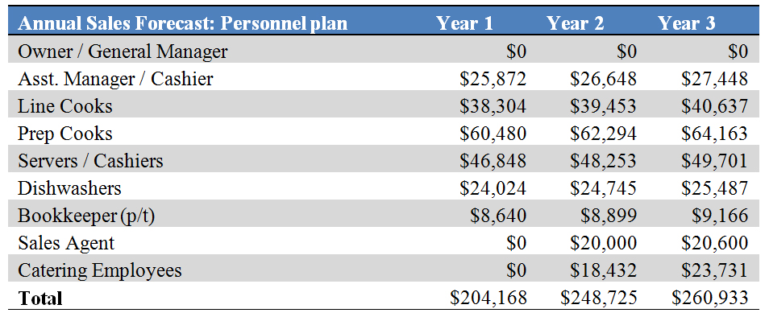

Organization and Management 
***************************

Organizational Structure
========================

THR expects to hire 19 employees.  Together, Jeff and Betty Wright will personally select each candidate.   They’ve adopted an effective interview process designed to staff the restaurant with highly qualified people for each position.  Each applicant will be rated and evaluated according to a pre-defined set of standards designed for each position.  Background checks will be utilized for designated positions. Recruiting efforts will always center on referrals. 

Management Team
================
The restaurant will be owned by Jeff Wright.  Jeff began his restaurant career at the age of 15 working in a quick-service food-service operation and earned his way through college as a server and bartender.  After earning his degree, he worked for a regional restaurant chain and an independent fine dining restaurant.  In these organizations he held the positions of Assistant Manager and then General Manager.

Betty Wright received her Culinary Degree from the Art Institute in Dallas.  After graduation she was employed by a local chain restaurant and then at a Five Star Hotel in Dallas.  Betty will initially be employed as the Kitchen Manager.  

Management Team Gaps
====================

Initially Jeff and Betty will fill in many of the management gaps.  Over time, they have plans to hire a sales director, a general manager, and a kitchen manager.

To meet the gaps associated in payroll, inventory management, and cost accounting, the Wrights will purchase have considered a POS (point of sale system) that it simplifies communications between the kitchen and the wait staff. Orders go through the computer, directly to the kitchen printer.  Another benefit of a restaurant POS programs is that it can track everything from food usage, to the most popular menu items. Because the POS system acts as a time clock, it can also help prepare payroll – which will save some money in the bookkeeping department.  Along with the daily operations of running a restaurant, a POS system can organize profit and loss statement and sales tax. 

Personnel Plan
===============

   Personnel Plan Annual Sales Forecast
